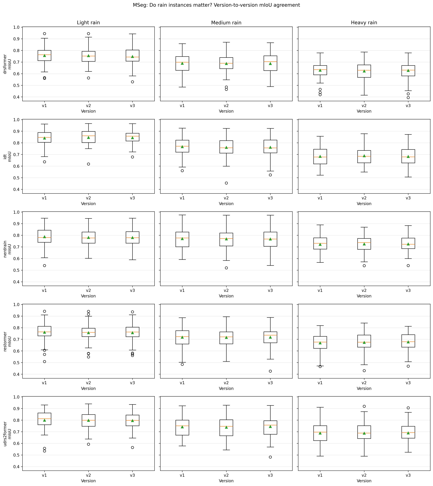

# Rain-Robust Semantic Segmentation

An independent study of how synthetic rain and image deraining affect semantic segmentation in urban driving scenes.

The project applies multiple rain conditions to a Cityscapes subset, restores the degraded images with five deraining models, and evaluates the resulting images with four semantic-segmentation systems. The repository contains the experimental notebooks, reusable inference scripts, summary measurements, and representative figures. Large datasets, model weights, caches, and exhaustive generated outputs are intentionally excluded.

## Portfolio highlights

This project demonstrates an end-to-end computer-vision research workflow: synthetic adverse-weather generation, multi-model image restoration, semantic-segmentation inference, experiment aggregation, and cautious interpretation of downstream robustness. The study evaluates five derainers and four segmentors across three rain severities and three rain realizations per severity.

## Research question

Can a learned deraining model recover semantic-segmentation consistency lost under synthetic rain, and how does that effect change with rain severity, rain realization, derainer, and segmentor?

## Experimental design

- Dataset: 50 Cityscapes images from the Aachen sequence
- Weather conditions: clean plus light, medium, and heavy synthetic rain
- Rain variants: three realizations per severity
- Derainers: DRSformer, IDT, NeRD-Rain, Restormer, and UDR-S2Former
- Segmentors: MSeg, SegFormer, Mask2Former, and OneFormer
- Primary metric: mean intersection over union (mIoU) against clean-image predictions
- Secondary analyses: image-level distributions, overlays, and comparisons with clean-image predictions

The pipeline is:

```text
Cityscapes images
      |
      v
synthetic rain (3 severities x 3 variants)
      |
      +--------------------+
      |                    |
      v                    v
direct segmentation    image deraining (5 models)
      |                    |
      +----------+---------+
                 v
      semantic segmentation (4 models)
                 |
                 v
       mIoU and qualitative analysis
```

## Selected results

The available MSeg summary contains 50 image-level evaluations for every derainer, severity, and rain variant. Averaging the three variants gives:

| Derainer | Light | Medium | Heavy | Overall |
|---|---:|---:|---:|---:|
| DRSformer | 0.753 | 0.688 | 0.626 | 0.689 |
| IDT | **0.844** | 0.763 | 0.685 | **0.764** |
| NeRD-Rain | 0.783 | **0.769** | **0.724** | 0.759 |
| Restormer | 0.758 | 0.718 | 0.673 | 0.716 |
| UDR-S2Former | 0.798 | 0.742 | 0.689 | 0.743 |

These measurements show that agreement with clean-image predictions generally declines as rain becomes heavier. IDT has the highest overall mean in this MSeg subset, while NeRD-Rain has the strongest mean under medium and heavy rain. These values compare the restored images within the recorded experiment; they should not be interpreted as general benchmark rankings.

### Metric scope

The recorded final comparison uses each segmentor's clean-image prediction as the reference. It therefore measures prediction consistency under rain and deraining, not absolute semantic-segmentation accuracy against Cityscapes ground-truth labels. A lower score means that a model's prediction changed more from its clean-image behavior; it does not by itself prove that the changed prediction is less accurate.



Additional per-derainer and cross-segmentor figures are available in [`results/figures`](results/figures). The underlying MSeg summary is in [`results/tables/mseg_rain_instance_miou_summary.csv`](results/tables/mseg_rain_instance_miou_summary.csv).

## Repository structure

```text
.
├── notebooks/                 # Cleaned experimental notebooks, in workflow order
├── scripts/                   # Reusable semantic-segmentation inference utilities
├── results/
│   ├── examples/              # Small qualitative sample
│   ├── figures/               # Analysis plots
│   └── tables/                # Summary data and run manifest
├── docs/
│   ├── METHODOLOGY.md         # Detailed experiment design
│   ├── REPRODUCIBILITY.md     # Setup, data, and execution notes
│   └── THIRD_PARTY.md         # External model and tool attribution
├── requirements.txt
├── CITATION.cff
├── tests/                     # Lightweight repository integrity checks
└── LICENSE
```

## Notebooks

The notebooks document the original research process and are ordered by their role in the pipeline:

1. `01_rain_and_fog_generation.ipynb`
2. `02_deraining_models.ipynb`
3. `03_semantic_segmentation.ipynb`
4. `04_evaluation_and_analysis.ipynb`
5. `05_optical_flow.ipynb`
6. `06_custom_rain_rendering.ipynb`

They preserve the original experimental code, including some cluster-specific absolute paths. Execution output and environment-installation logs were removed for a smaller and safer repository. See [`docs/REPRODUCIBILITY.md`](docs/REPRODUCIBILITY.md) before rerunning them.

## Quick start

```bash
python -m venv .venv
source .venv/bin/activate
pip install -r requirements.txt
```

To cache the three Hugging Face segmentors used by the reusable script:

```bash
python scripts/download_cityscapes_segmentors.py
```

To produce segmentation masks for a directory of images:

```bash
python scripts/run_cityscapes_segmentor.py \
  --model_type segformer \
  --input_dir /path/to/images \
  --output_dir /path/to/masks
```

Valid model types are `segformer`, `mask2former`, and `oneformer`. The script selects CUDA when available and otherwise uses the CPU.

## Repository validation

The lightweight validation suite checks that notebooks remain valid JSON without saved execution output, Python scripts compile, and no tracked file exceeds GitHub's standard file-size limit.

```bash
python -m unittest discover -s tests -v
```

The same checks run automatically on pushes and pull requests through GitHub Actions.

To regenerate the compact MSeg table from the recorded per-variant summary:

```bash
python scripts/summarize_mseg_results.py
```

## Data and scope

Cityscapes data is not redistributed here. Obtain it under the terms provided by the [Cityscapes dataset](https://www.cityscapes-dataset.com/). Model weights are also excluded and must be obtained from their original providers.

This repository is a compact research record, not a one-command reproduction package. Full reproduction requires the external repositories and pretrained models listed in [`docs/THIRD_PARTY.md`](docs/THIRD_PARTY.md), plus the original dataset and sufficient GPU resources.

## License

Original repository code and documentation are released under the MIT License. External projects, models, datasets, and papers retain their own licenses and terms; see [`docs/THIRD_PARTY.md`](docs/THIRD_PARTY.md).
